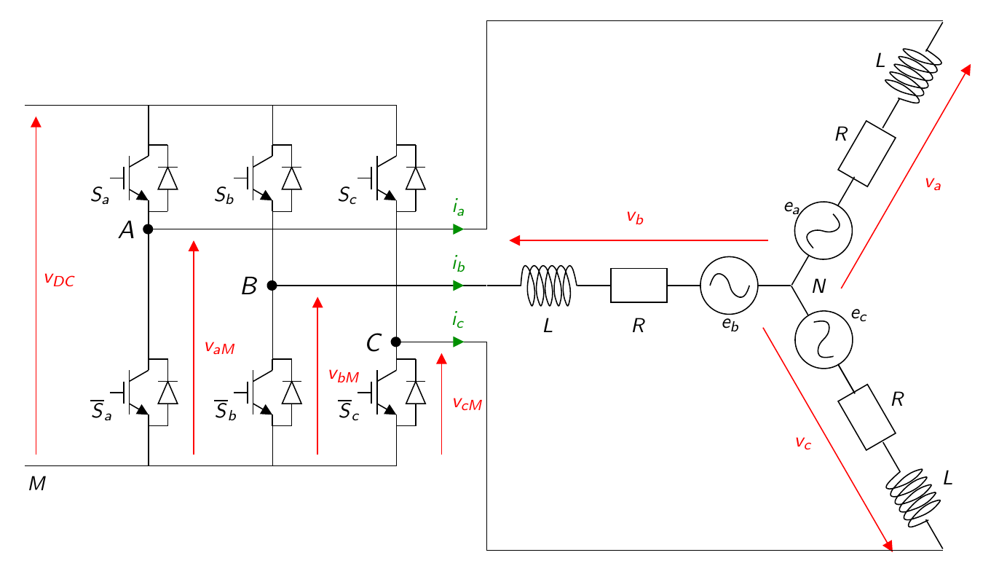
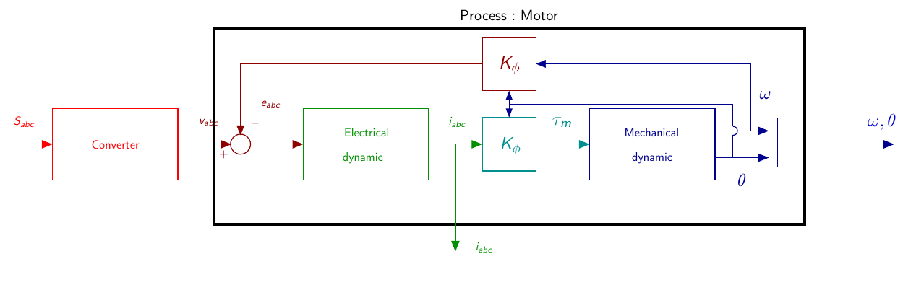

# PMSM Description

## Operative part scheme

The figure below represents the whole system including the motor and its inverter.

The system can be described with the following bloc diagram.

## [PMSM Modeling](PMSMModeling.html)

The page describes the dynamical equations of the motor as well as the classically used transformations (Clarke and Park).

## [PMSM Control](PMSMControl.html)

In this page, a classical vector control is proposed for the speed control of the motor.

------

## Site Map

- [PMSM Description](PMSM.html) | [PMSM Modeling](PMSMModeling.html) - [PMSM Control](PMSMControl.html)
- [Mplab Device Block For Simulink](../MplabForSimulink/MplabForSimulink.html)
- [Embedded Motor Control](../RCP/PMSMRCP.html) | [Getting Started](../RCP/GettingStarted.html) - [Block configuration for Motor Control](../RCP/BlockconfigurationforMotorControl.html) - [Simulation Simulink models](../RCP/Simulation.html) - [Embedded Simulink models](../RCP/EmbeddedModels.html)
- [GUI (Graphical User Interface)](../GUI/GUI.html)

## Site Map

- [PMSM Description](/PMSM.md) / [PMSM Modeling](PMSMModeling.html) - [PMSM Control](PMSMControl.html)
- [Mplab Device Block For Simulink](../MplabForSimulink/MplabForSimulink.md)
- [Embedded Motor Control](../RCP/PMSMRCP.md)
- [GUI (Graphical User Interface)](../GUI/GUI.md)

