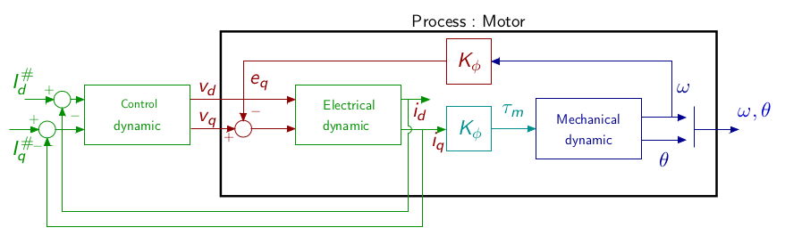
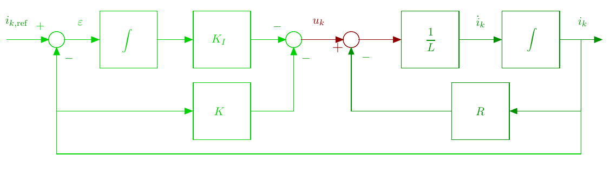
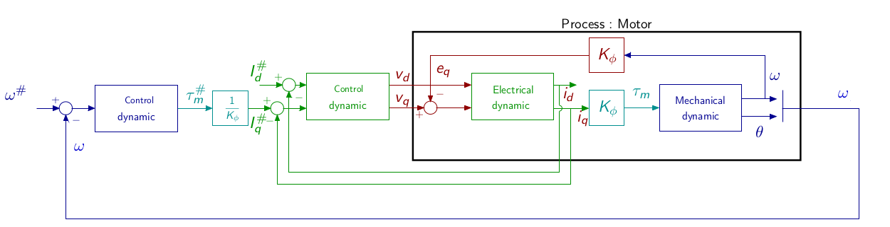
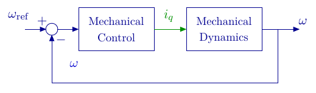

#  PMSM vector control

The page describes  a classical cascaded vector control. Based on the motor frequency separation (i.e. a fast electrical dynamics and a slower mechanical dynamics) the control is divided in two loops:

- An inner loop for the electrical dynamics
- An outer loop for the mechanical dynamic

## $d-q$ model

The model of the motor in the $dq$ frame is :

$$
\left\{\begin{array}{rcl}
L \frac{di_d}{dt} & = & v_d-R i_d + Lp\Omega i_q\\\\
L \frac{di_q}{dt} & = & v_q-R i_q - Lp\Omega i_d -\phi_f  p\Omega\\\\
J\frac{d\Omega}{dt} &=& \tau_m -\tau_r \\\\
{\frac{d\theta}{dt}} &=& \Omega\\
\end{array}\right.
$$

$$
\tau_m = p\frac{3}{2}\phi_f  i_q
$$

## Electrical Dynamics

Consider the electrical equations : 
$$
\left\{
\begin{array}{rcl}
L \frac{di_d}{dt} & = & v_d-R i_d + Lp\Omega i_q\\\\
L \frac{di_q}{dt} & = & v_q-R i_q - Lp\Omega i_d -\phi_f  p\Omega
\end{array}\right.
$$

### Feedback linearization 

The model $d-q$ is still non-linear. Based on this model, choosing $v_d$ and $v_q$ as \(Bodson1993):
$$
\left\{
\begin{array}{lcl}
v_d &=& u_d - Lp\Omega i_q\\
v_q &=& u_q + Lp\Omega i_d+\phi_f p\Omega\\
\end{array}
\right.
$$
 One has :
$$
\left\{
\begin{array}{rcl}
L \frac{di_d}{dt} & = & u_d-R i_d\\\\
L \frac{di_q}{dt} & = & u_q-R i_q
\end{array}\right.
$$
whether two decoupled electrical equations. Each current can thus be controlled independently. Therefore, linear control techniques can be used. 

**Feedback control with integral action**

The for each electrical current $i_k;k\in{d,q}$, the dynamic is given by

$$
\begin{array}{lcl}
\frac{di_k}{dt} &=& \frac{1}{L}u _k -\frac{R}{L} i_k\\
     &=& \frac{K_e}{\tau_e}u_k -\frac{1}{\tau_e} i_k 
\end{array}
$$

The control objective is to ensure $i_k^\star =i_{\rm ref}$, where $i^\star$ is the current at steady state and $i_{\rm ref}$ is the reference current. To ensure zero steady state error, an integral action is necessary. The principle is to insert an integral action in the loop between the error compactor and the process \(Ogata2010\). The control scheme is given by :

From the figure one gets :

$$
\begin{array}{lcl}
   \dot{i}_k  & = & -\frac{R}{L} i_k + \frac{1}{L}u_k\\
   \dot{\varepsilon} & = & i_{\rm ref} - i_k \\
   u & = & -Ki_k+K_I\varepsilon
\end{array}
$$

with $\varepsilon$ the output of the integrator.

The system dynamics can be described by

$$
\begin{bmatrix}
\dot{i_k}\\\dot{\varepsilon}
\end{bmatrix} = 
\begin{bmatrix}
-\frac{R}{L} & 0\\-1 &0
\end{bmatrix} \begin{bmatrix}
{i_k}\\{\varepsilon}
\end{bmatrix}+
\begin{bmatrix}
\frac{1}{L}\\0
\end{bmatrix}u_k+
\begin{bmatrix}
0\\1
\end{bmatrix}i_{k,\rm ref}
$$

with the control

$$
u_k  =  -Ki_k-K_I\varepsilon
$$

The closed loop system leads to :

$$
\begin{bmatrix}
\dot{i_k}\\\dot{\varepsilon}
\end{bmatrix} = 
\left(\begin{bmatrix}
-\frac{R}{L} & 0\\-1 &0
\end{bmatrix} -
\begin{bmatrix}
\frac{1}{L}\\0
\end{bmatrix} \begin{bmatrix}K&K_I\end{bmatrix}\begin{bmatrix}i\\\varepsilon\end{bmatrix}\right)+
\begin{bmatrix}
0\\1
\end{bmatrix}i_{k,\rm ref}
$$

The closed loop dynamics depends on the eigenvalues of the matrix :

$$
\left(\begin{bmatrix}
-\frac{R}{L} & 0\\-1 &0
\end{bmatrix} -
\begin{bmatrix}
\frac{1}{L}\\0
\end{bmatrix} \begin{bmatrix}K&K_I\end{bmatrix}\right)= 
\begin{bmatrix}
-\frac{R+K}{L} & -\frac{K_I}{L}\\-1 &0
\end{bmatrix}
$$

One has

$$
{\rm eig}\left(
\begin{bmatrix}
-\frac{R+K}{L} & -\frac{K_I}{L}\\-1 &0
\end{bmatrix}\right) = {\rm det}\left(sI-\begin{bmatrix}
-\frac{R+K}{L} & -\frac{K_I}{L}\\-1 &0
\end{bmatrix}\right)
$$

It leads to a characteristic equation

$$
P(s) = s^2+\frac{K+R}{L}s -K_I
$$

to be identified with the classical second order characteristic equation

$$
P(s) = p^2+2\zeta\omega_n s +\omega_n^2
$$

where $\omega_n$ is the desired closed loop natural frequency and $\zeta$ the damping coefficient.

## Mechanical Dynamic

Assuming the electrical control has been correctly synthesized with respect to frequency separation principle, which means that the closed loop electrical dynamics is faster than the mechanical desired dynamics, then the mechanical dynamic control synthesis can be designed without considering the closed loop electrical system. The control scheme can be simplified as :

Considering a motor without load, the load torque can be reduced to the motor friction modeled as : 
$$
\tau_r = f\Omega
$$
The mechanical dynamic is

$$
\begin{array}{lcl}
\dot{\omega} &=&  \frac{1}{J}\tau_m-\frac{f}{J}\Omega\\
    &=&  \frac{K_\phi}{J}i-\frac{f}{J}\omega
\end{array}
$$

where $T_m = K_\phi i$

The control synthesis is similar than the one proposed for the electrical dynamics with $\dot\varepsilon_\omega = \omega_{\rm ref}-\omega$ leading to

$$
\begin{bmatrix}
\dot{\omega}\\\dot{\varepsilon_\omega}
\end{bmatrix} = 
\begin{bmatrix}
-\frac{f}{J} & 0\\-1 &0
\end{bmatrix} \begin{bmatrix}
{\omega}\\{\varepsilon_\omega}
\end{bmatrix}+
\begin{bmatrix}
\frac{K_\phi}{J}\\0
\end{bmatrix}i+
\begin{bmatrix}
0\\1
\end{bmatrix}\omega_{\rm ref}
$$

with the control

$$
i  =  -K_\omega \omega-K_{\omega,I}\varepsilon_\omega
$$

By analogy, it leads to a characteristic equation

$$
P(s) = s^2+\frac{K_\phi K_\omega+f}{L}s -K\phi K_{\omega,I}
$$

to be identified with the classical second order characteristic equation

$$
P(s) = p^2+2\zeta\omega_n s +\omega_n^2 .
$$

## References

\(Bodson1993) Bodson, M., Chiasson, J.-N., Novotnak, R.-T., & Rekowski, R.-B. (1993). High performance nonlinear feedback control of a permanent magnet stepper motor. *IEEE Transactions on Control Systems Technology*, *1*(1), 5–14. https://doi.org/10.1109/87.221347

\(Ogata2010\) Ogata, K. \(2010\). Modern Control Engineering. Prentice Hall.

------

## Site Map

- [PMSM Description](PMSM.md) / [PMSM Modeling](PMSMModeling.html) - [PMSM Control](PMSMControl.html)
- [Mplab Device Block For Simulink](../MplabForSimulink/MplabForSimulink.md)
- [Embedded Motor Control](../RCP/PMSMRCP.md)
-  [GUI (Graphical User Interface)](../GUI/GUI.md)