# Block configuration for Motor Control

## System Configuration

The Mplab Solution do not support continuous time. Indeed micro-controllers are themselves discrete. 

- The first step is to define the Simulink motel settings as follow : 

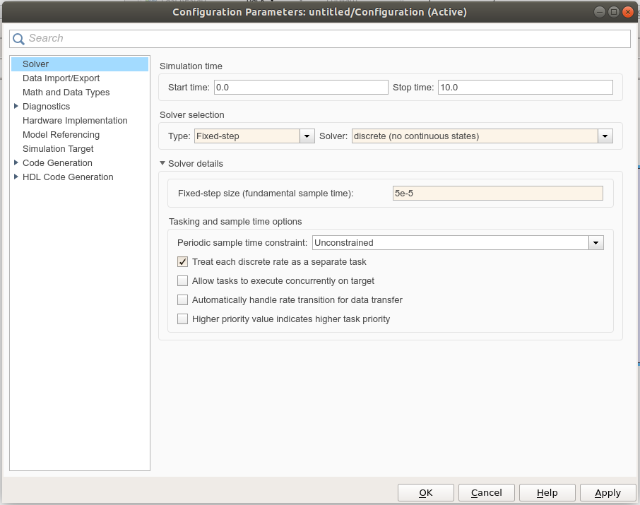

The Mplab Solution for Simulink adds to the Simulink Library Browser a library including all the available blocks for the micro-controller. 

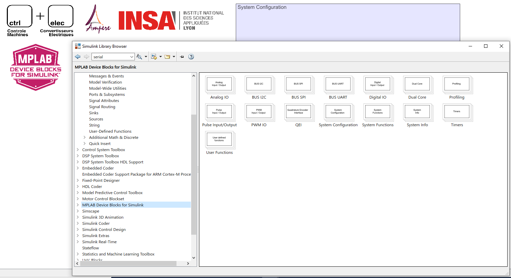

- Systems configuration : 

Add the following blocks :

 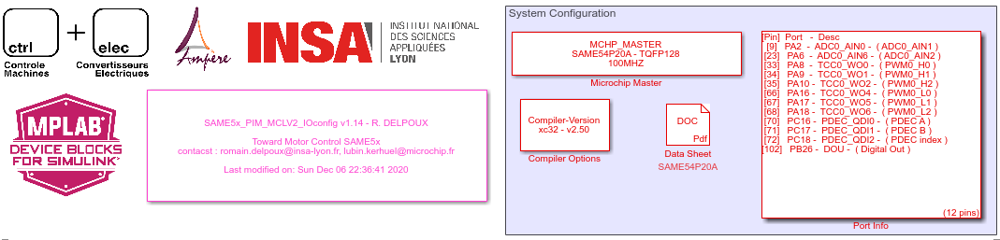

And configure the Microchip master. It allows the choice of the micro-controller,  and the oscillator. For this project, the block must be configured as follow : 

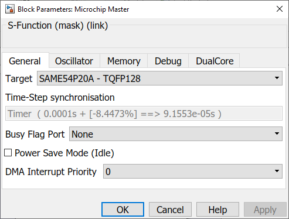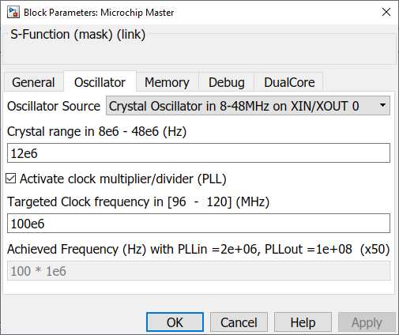

- Compiler Options 

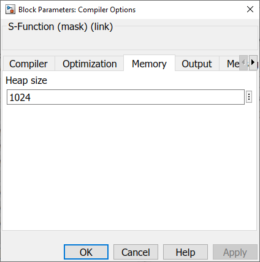

- Debug LED

The first step to verify the configuration is to blink a LED for example with a frequency of 5Hz.

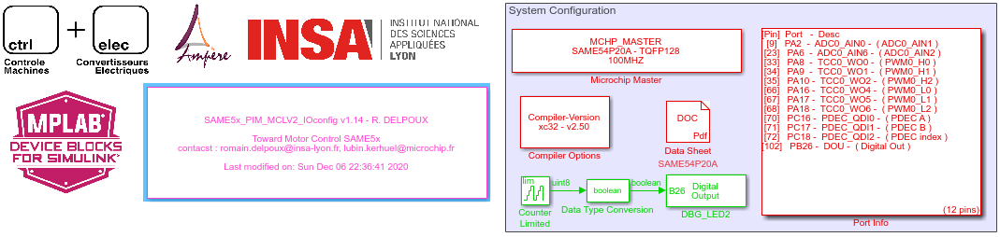

## Motor interface

 For motor vector control, three blocks need to be inserted and configured :

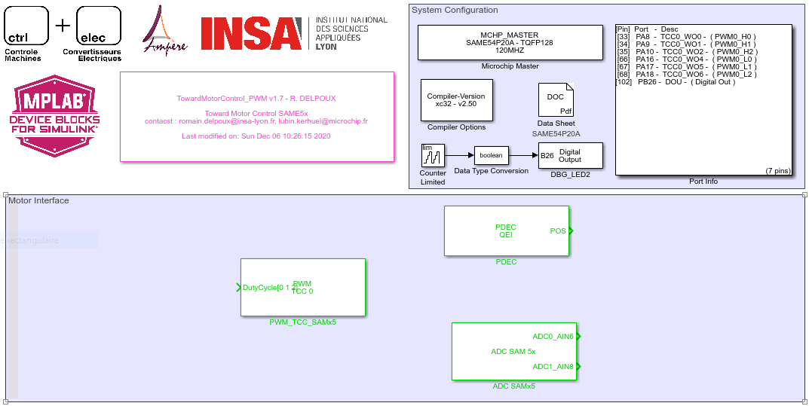

- Pulse Width Modilation (PWM)
- Quadrature Encoder (PDEC)
- Analog Digital Converters (ADC)

### Pulse Width Modulation (PWM)

The PWM bloc needs to be configured carrefully : 

- The modulation frequency is chosen equal to **20kHz (5e-5s)**
- To synchronize the ADC measurement with the PWM. The PWM is generated **center aligned**. Indeed it allow the take ADC sample at the beginning of the period and measure an average current avoiding spikes caused by the switching. The ADC synchronization is represented on the figure below
- The avoid short-circuits a **dead time** needs to be added between the switching of the High and Low switch. The dead time is chosen equal to **Td = 0.5e-6s** with respect to the switch datasheet.

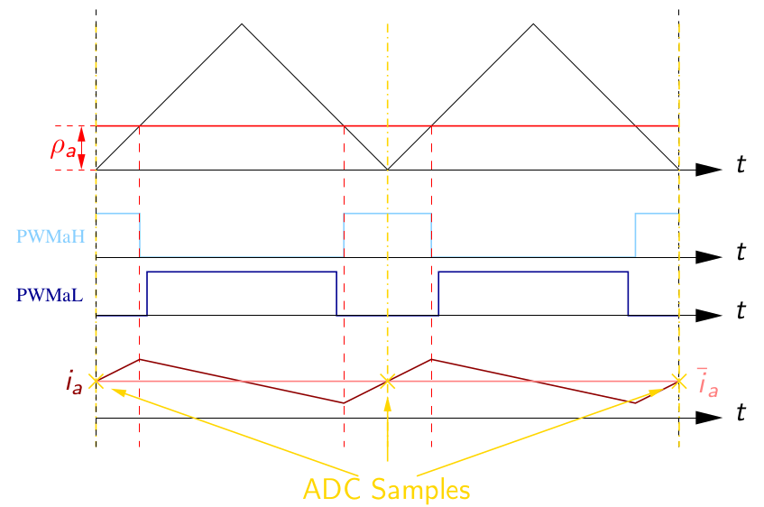

The bloc configuration is the following :

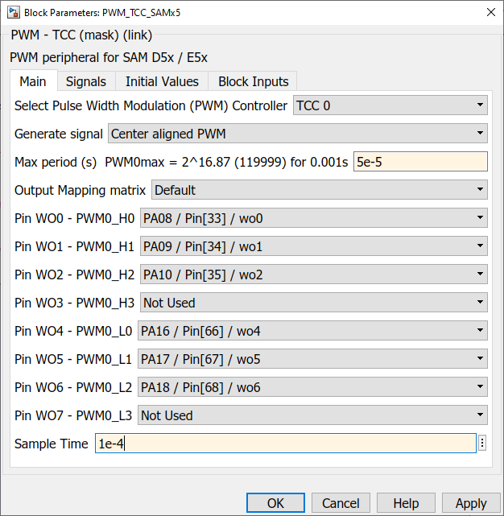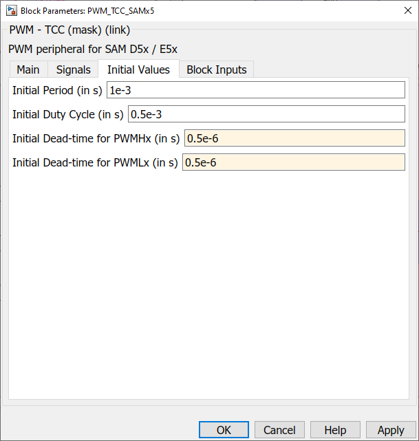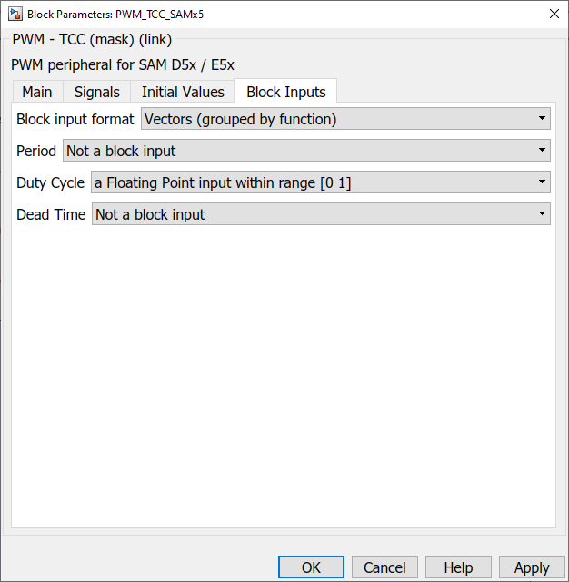

### Encoder 

The quadrature encoder encoder peripheral blocks for the SAM E5x is PDEC. It allows to provide position which can be reseted  with using encoder index. 

For the index to work, in the options tab, The Enable Auto-correction must be unchecked.

The block configuration is the following : 

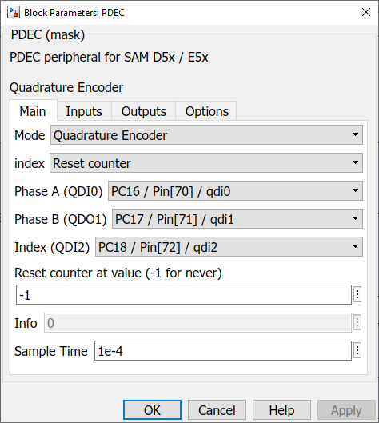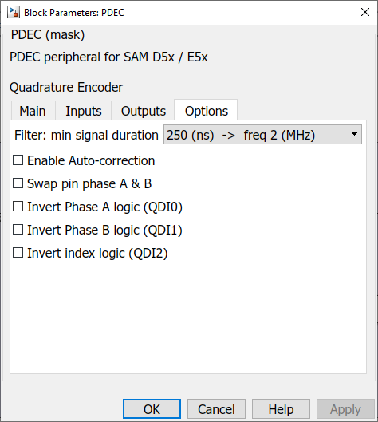

### ADC

**Currents measurements:**

All Shunt resistances are **0.025 Ohms**.

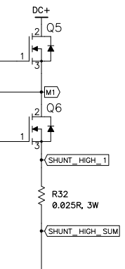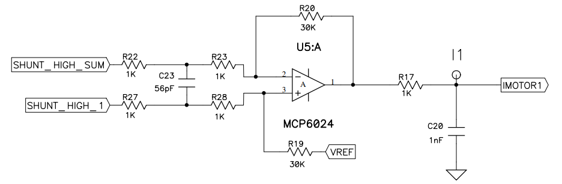

Two shunts measures Ia and Ib on PWM1 and PWM2 (low side). The third shunt measure Ibus which is the current sum of the three PWM (low side) currents.

Op-Amps (Internal or External) with a **gain of 15** boost low voltage measured to higher voltage converted by the dsPIC ADC for signals Ia, Ib and Ibus. 

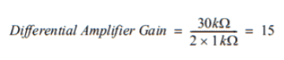

Vadc=0.025∗15∗Ishunt

For the ADC configured for 12 bits right aligned conversion, the raw output represents:

ADCout=0.025∗15∗4096/3.3∗Ishunt=465.45∗Ishunt

The maximum measurable current is +-4.4 A which provides values within [0 4096] range.

And must be configured as follow : 

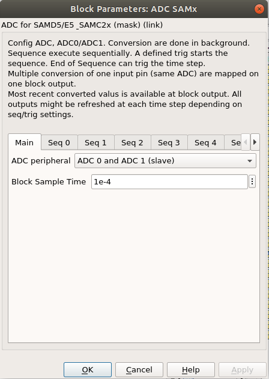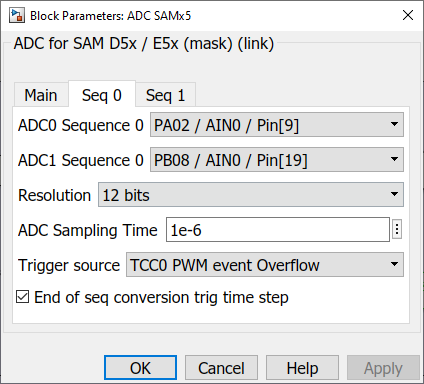

## Site Map

- [PMSM Description](../MotorModeling/PMSM.html) / [PMSM Modeling](../MotorModeling/PMSMModeling.html) - [PMSM Control](../MotorModeling/PMSMControl.html)
- [Mplab Device Block For Simulink](../MplabForSimulink/MplabForSimulink.html)
- [Embedded Motor Control](../RCP/PMSMRCP.html) / [Getting Started](../RCP/GettingStarted.html) - [Block configuration for Motor Control](../RCP/BlockconfigurationforMotorControl.html) - [Simulation Simulink models](../RCP/Simulation.html) - [Embedded Simulink models](../RCP/EmbeddedModels.html)
- [GUI (Graphical User Interface)](../GUI/GUI.html)

