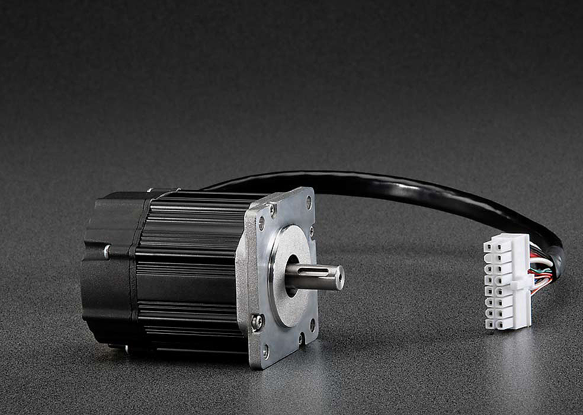
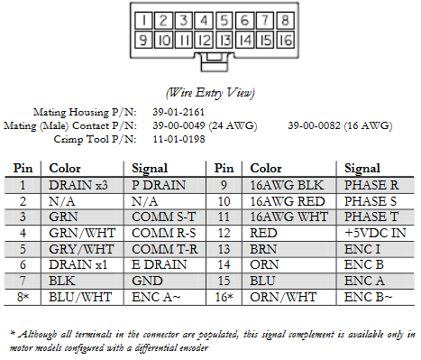
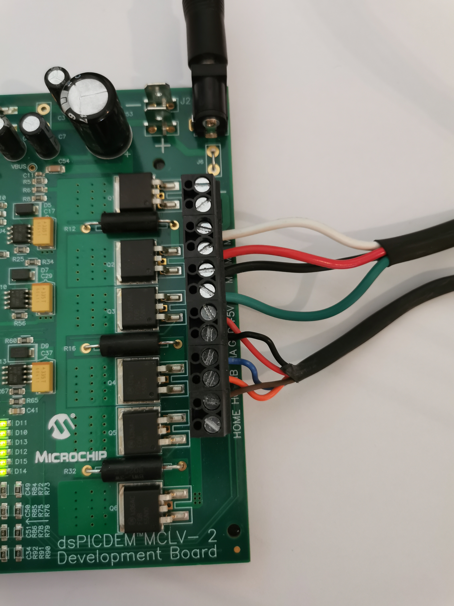
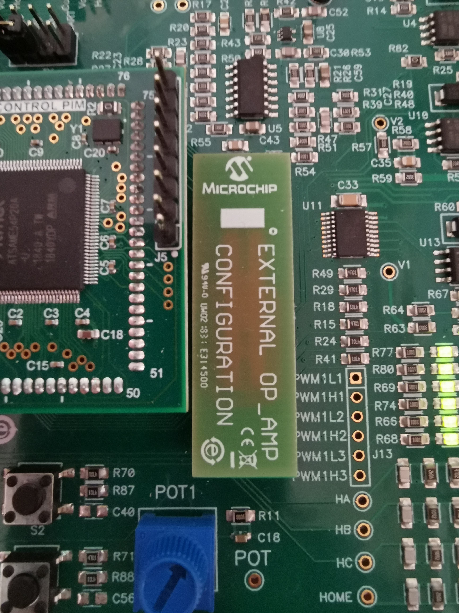
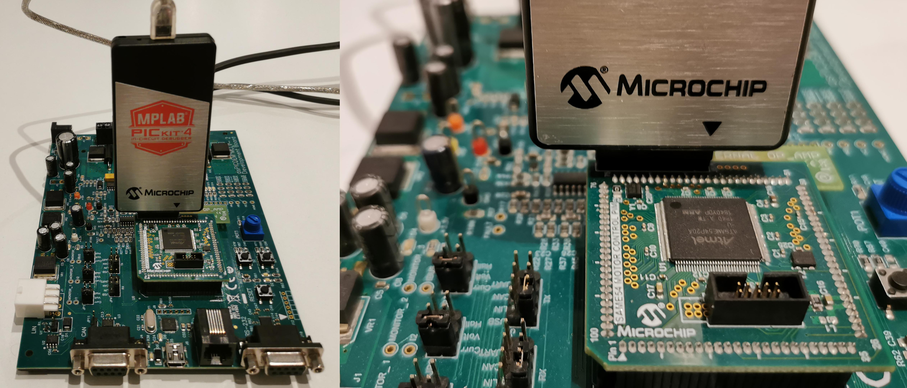

# Getting Started

## Table of contents

1. [Requirements](#requirements)
2. [Motor specifications](#motor)
3. [Hardware configuration ]("config")
4. [Programmer]("prog")

## Requirements 

#### Hardware requirements:

- [MCLV-V2](https://www.microchip.com/dsPICDEMMCLV-2DevelopmentBoard866) Motor Control Board
- [PIM ATSAME54](https://www.microchip.com/DevelopmentTools/ProductDetails/PartNO/MA320207) with external Op-Amp
- Programmer ([PICkit 4](https://www.microchip.com/pickit4), [ICD4](https://www.microchip.com/icd4), [Real-Ice](https://www.microchip.com/realice), [PICkit 3](https://www.microchip.com/pickit3), [ICD3](https://www.microchip.com/icd3), ...)
- PMSM motor ([N23 Industrial Grade Motors](https://rdelpoux.github.io/Datasheets/N23_Industrial_Grade_Motors_v6.0.pdf))
- Cable to send data from the MCLV board (Tx) to the PC (Rx) (like a [FTDI cable](https://www.ftdichip.com/Products/Cables/USBTTLSerial.htm))

#### Software requirements:

- Matlab/Simulink
  - Embedded coder (Matlab Coder & Simulink Coder)
  - Fixed point toolbox
- [MPLAB device blocks for Simulink](https://www.microchip.com/SimulinkBlocks)
- [MPLAB X IDE](https://www.microchip.com/MPLABX) development (required to flash the binary from matlab)
- [XC32](https://www.microchip.com/en-us/development-tools-tools-and-software/mplab-xc-compilers) compiler

The verify correct configuration you can use the test program 

- [here for Matlab 2020b](https://github.com/rdelpoux/rdelpoux.github.io/blob/master/Dev/Config/SAME5x_PIM_MCLV2_Test_programme.slx)
- [here for Matlab 2018b](https://github.com/rdelpoux/rdelpoux.github.io/blob/master/Dev/Config/SAME5x_PIM_MCLV2_Test_programme_2018b.slx)

## 

## Motor specifications 

The proposed motor for this experimentation is a Permanent Magnet Synchronous Motor (PMSM) The  ([N23 Industrial Grade Motors](https://rdelpoux.github.io/Datasheets/N23_Industrial_Grade_Motors_v6.0.pdf))

### Motor parameters

The motor parameters are :

| Parameter         | Value                 |
| ----------------- | --------------------- |
| Max voltage       | V = 24V               |
| Max current       | I = 4A                |
| Pole pairs number | p=4                   |
| Stator resistance | R=0.6 Ohm             |
| Stator inductance | L= 0.35mH             |
| Flux constant     | Phif = 6.6mWb         |
| Inertia           | J =1.10^-5 kg.m^2     |
| Fluid friction    | f = 1.10^-5 N.m.s/rad |

The motor parameters have been identified on-line using the procedure described on the video : 

["All In One" motor Parameters Identification and control embedded in a dsPIC DSCs](https://www.youtube.com/watch?v=YwpB8wvrOGs)

Further details can be found on the identification procedure can be found in the article available [here](https://www.sciencedirect.com/science/article/abs/pii/S0967066114000458):

- R. Delpoux, M. Bodson, T. Floquet, Parameter estimation of permanent magnet stepper motors without mechanical sensors, Control Engineering Practice, Volume 26, 2014, Pages 178-187.

The motor is equipped with an incremental encoder. The encoder hat 1000 counts/rev.

### Motor connection

The connexion between the motor and the MCLV-V2 is shown below :

## Hardware configuration 

### Pinout of the [MCLV-V2](https://www.microchip.com/dsPICDEMMCLV-2DevelopmentBoard866)  with the [PIM ATSAME54](https://www.microchip.com/DevelopmentTools/ProductDetails/PartNO/MA320207) and external Op-AMP

The pinout of the MCLV-2 board with the [PIM ATSAME54](https://www.microchip.com/DevelopmentTools/ProductDetails/PartNO/MA320207) and external Op-AMP configuration is described in its [Information Sheet](https://www.microchip.com/DevelopmentTools/ProductDetails/PartNO/MA320207).

It is important to verify that External OP_AMP Configuration is plugged :

The table below provide important pinout informations.

| MCLV-2 Board | ATSAME54  |
| :----------: | :-------: |
|     LED1     |    B27    |
|     LED2     |    B26    |
|              |           |
|    BTN S2    |    D9     |
|    BTN S3    |    D10    |
|              |           |
|   UART\_Rx   |    A13    |
|   UART\_Tx   |    A12    |
|              |           |
| PWM1 \(L/H\) | A16 - A8  |
| PWM2 \(L/H\) | A17 - A9  |
| PWM3 \(L/H\) | A18 - A10 |
|              |           |
| HALLA / QEA  |    C16    |
| HALLB / QEB  |    C17    |
| HALLC / INDX |    C18    |
|              |           |
|     Pot      |    A06    |
|      Ia      |    A02    |
|      Ib      |    B08    |

## Programmer 

Programmers like PicKit or Snap can directly be connected to the [PIM ATSAME54](https://www.microchip.com/DevelopmentTools/ProductDetails/PartNO/MA320207) as shown on the picture below.

